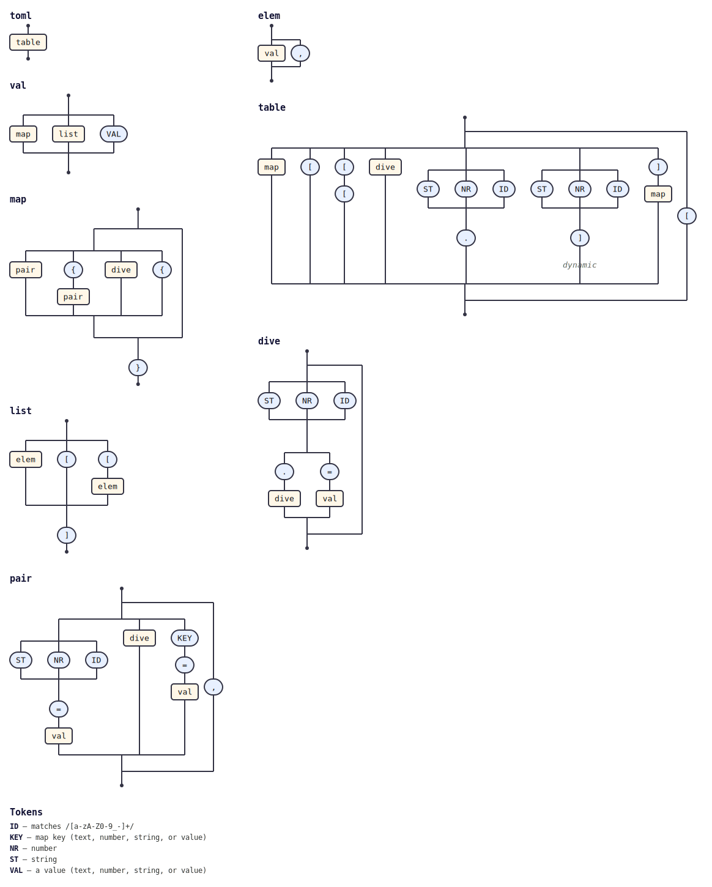

# @tabnas/toml

A [TOML](https://toml.io) parser built as a grammar plugin on the
[tabnas](https://github.com/tabnas/parser) engine and the
[jsonic](https://github.com/tabnas/jsonic) relaxed-JSON grammar. One
grammar, two runtimes: a TypeScript/JavaScript plugin and a Go port that
parse the same syntax into native objects/maps.

| Path | Description |
|---|---|
| [`ts/`](ts/) | TypeScript / JavaScript implementation (`@tabnas/toml`). |
| [`go/`](go/) | Go port (`github.com/tabnas/toml/go`). |
| [`toml-grammar.jsonic`](toml-grammar.jsonic) | The single shared grammar, embedded into both. |
| [`test/spec/`](test/spec/) | Shared conformance fixtures, run by both runtimes. |

## Install

TypeScript / JavaScript:

```sh
npm install @tabnas/toml @tabnas/parser @tabnas/jsonic
```

Go:

```sh
go get github.com/tabnas/toml/go@latest
```

## One tiny example

TypeScript / JavaScript:

```js
const { Tabnas } = require('@tabnas/parser')
const { jsonic } = require('@tabnas/jsonic')
const { Toml } = require('@tabnas/toml')

const toml = new Tabnas().use(jsonic).use(Toml)

toml.parse('title = "TOML Example"\n[owner]\nname = "Tom"')
// => { title: 'TOML Example', owner: { name: 'Tom' } }

// One expression, verified:
toml.parse('a = 1\nb = [2, 3]')   // => { a: 1, b: [2, 3] }
```

Go:

```go
import tabnastoml "github.com/tabnas/toml/go"

result, err := tabnastoml.Parse(`
title = "TOML Example"
[owner]
name = "Tom"
`)
// result == map[string]any{"title": "TOML Example", "owner": map[string]any{"name": "Tom"}}
```

## Documentation

The docs follow the [Diataxis](https://diataxis.fr) framework — one file
per purpose, per language:

| Purpose       | TypeScript | Go |
|---------------|-----------|----|
| Tutorial (learn) | [ts/doc/tutorial.md](ts/doc/tutorial.md) | [go/doc/tutorial.md](go/doc/tutorial.md) |
| How-to (recipes) | [ts/doc/guide.md](ts/doc/guide.md) | [go/doc/guide.md](go/doc/guide.md) |
| Reference (API + syntax) | [ts/doc/reference.md](ts/doc/reference.md) | [go/doc/reference.md](go/doc/reference.md) |
| Concepts (how & why) | [ts/doc/concepts.md](ts/doc/concepts.md) | [go/doc/concepts.md](go/doc/concepts.md) |

The Go [concepts](go/doc/concepts.md) page includes a "Differences from
the TS version" section (value types, API shape, known differences).

## Grammar diagram

The installed grammar as a railroad/syntax diagram, generated from the
live grammar with [`@tabnas/railroad`](https://github.com/tabnas/railroad):



ASCII version: [`ts/doc/grammar.txt`](ts/doc/grammar.txt).

## License

MIT. Copyright (c) Richard Rodger and other contributors.
